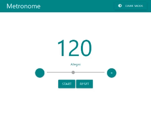

# METRONOME

## About

This project consists of a simple yet elegant metronome built using JavaScript, the [Web Audio API](https://developer.mozilla.org/en-US/docs/Web/API/Web_Audio_API#web_audio_concepts_and_usage), and the [Materialize CSS Framework](https://materializecss.com/).

## Features & How To Use

- Set the desired tempo (as BPM - Beats Per Minute) by either using the input field, slider, or "+plus" and "-minus" buttons.
- Once started, the metronome's tempo can be adjusted dynamically whilst playing by simply updating the tempo.
- The default tempo is 120 BPM, and the metronome can be reset to it's initial state using the "Reset" button.
- The page theme can be toggled between "LIGHT MODE" and "DARK MODE" with the theme button at the top right.

## Future features to be added

- Volume control
- Visualization of the tempo
- Musical measures
- Sound frequency control

## How To Run

- Clone the repository and cd into the `metronome` directory
- Run `npm install` in the terminal to install the [Materialize CSS Framework](https://materializecss.com/) dependency
- Use a local server and browser to open the index.html or, if using VSCode, use the [Live Server Extension](https://marketplace.visualstudio.com/items?itemName=ritwickdey.LiveServer)